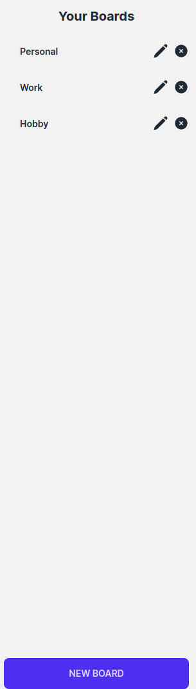

# TaskAI - AI Trello Board

TaskAI is an innovative, AI-enhanced Trello board designed to streamline task management and enhance productivity. This project integrates cutting-edge AI technology to assist users in summarizing, organizing, and optimizing their task boards. With features like AI-driven suggestions and the ability to create tasks directly from these suggestions, TaskAI is not just a task manager; it's a smart companion for personal and professional project management.

## Description

### Key Features:

- AI Integration: Leverage AI to summarize board contents and breakdown complex tasks.
- Customizable Boards: Create and manage multiple boards, columns, and tasks tailored to your needs.
- Drag and Drop Interface: Intuitive reorganization of tasks and columns for efficient management.
- Responsive Design: Seamlessly adapts to various devices for a consistent experience.

### Technologies Used:

- Next.js: Frontend framework with server-side rendering for a fast, SEO-friendly user experience.
- TypeScript: Ensures type safety and robust codebase.
- Tailwind CSS: Provides utility-first CSS for quick and efficient design customization.
- AppWrite: Backend solution handling database and storage requirements.
- DaisyUI: Simplifies UI design with a comprehensive component library.
- React Beautiful DND: Adds drag-and-drop functionalities with a beautiful, responsive feel.
- Zustand: Manages state in a simple, efficient manner for React apps.
- OpenAI: This package integrates advanced AI models from OpenAI.

### Future Implementations:

I hope to implement these other features over time:

- [ ] Enhance AI response accuracy and contextual understanding.
- [ ] Direct task creation from AI suggestions.
- [ ] Support for image attachments in tasks.
- [ ] User account creation and management.

## Screenshots

## How to Install and Run

### Install

7. Clone the repository: git clone `https://github.com/KBMaglalang/ai-trello-board`
8. Navigate to the directory: `cd ai-trello-board`
9. Install dependencies: `npm install`
10. Copy `.env.example` to `.env.local` or `.env`
11. Populate the `.env` file with necessary values and permissions.
12. Set up AppWrite databases and storage bucket.

### Run

1. Start the server: `npm run dev`
2. Access the app at localhost:3000 or the provided link in the terminal
